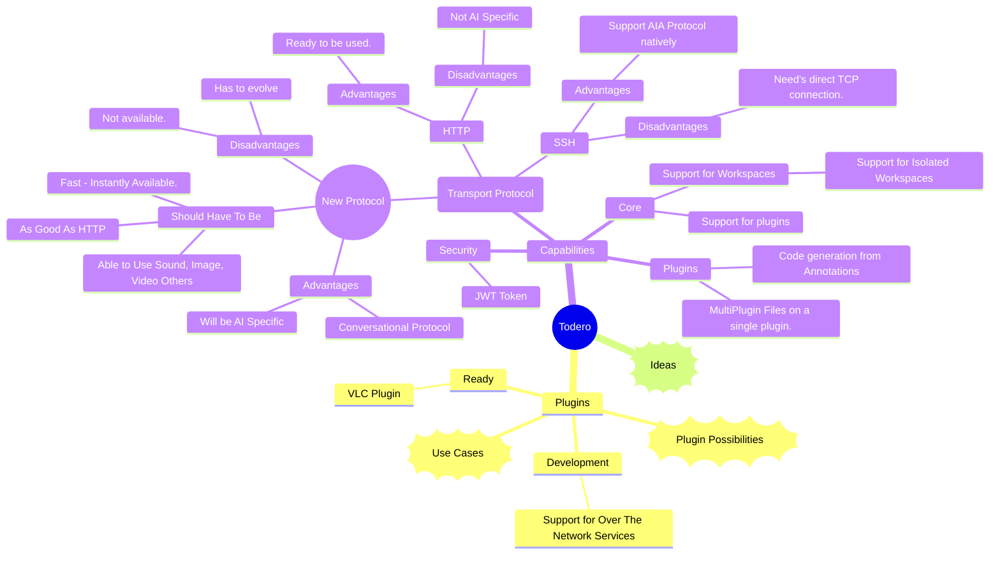
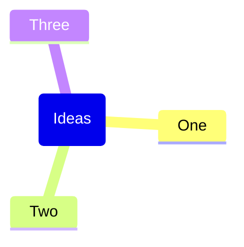
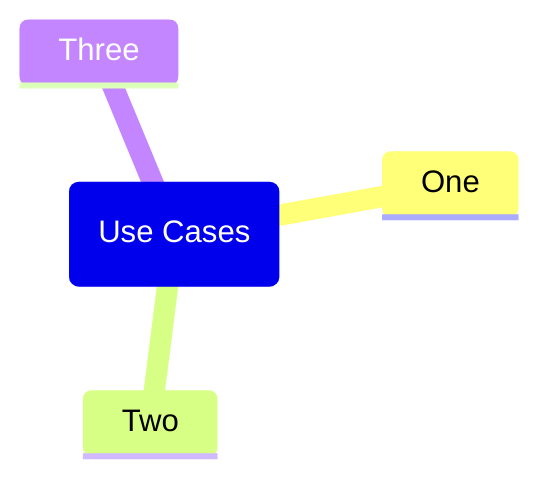
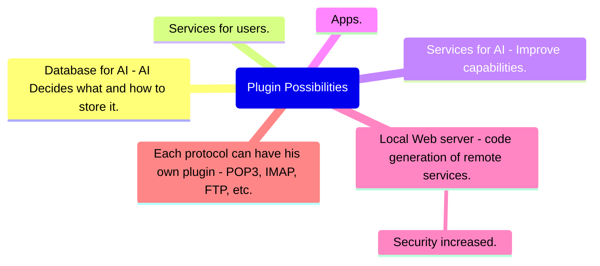

# Roadmap
- Support for plugin to connect to remote services.
- Implement Transport Protocol - connect streaming & disconnect.
- Support for workspaces.
- Support for Isolated workspaces.








```mermaid
B (OAuth 2.0 Authorization Code Flow with Offline Access)
```